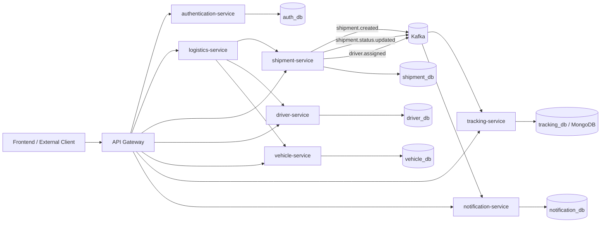

# Logistics System Architecture Standard

## 1. Muc tieu

Tai lieu nay la **source of truth** cho kien truc backend/frontend cua `LogisticSystem`.
Moi service moi, service sua doi, va moi integration flow trong he thong **phai tuan theo tai lieu nay**.

Tai lieu di kem bat buoc:

- `documents/general/SERVICE_BLUEPRINT.md`: dinh nghia chi tiet the nao la mot service dat chuan microservice best practices.

Muc tieu:

- Chot ro service nao duoc phep goi service nao.
- Chot ro luong dong bo va bat dong bo.
- Chot ro cach thiet ke package, API, event, database ownership va observability.
- Giam tinh trang moi service tu dinh nghia architecture rieng.

## 2. Danh gia hien trang repo

He thong hien tai da co nen microservices kha ro:

- `api-gateway`: diem vao HTTP ben ngoai.
- `authentication-service`: xac thuc, token, 2FA, gRPC verify.
- `logistics-service`: orchestrator cho luong dieu phoi.
- `shipment-service`: aggregate core cua van don.
- `driver-service`: CRUD va trang thai tai xe.
- `vehicle-service`: CRUD va trang thai phuong tien.
- `tracking-service`: luu lich su hanh trinh tu event.
- `notification-service`: phat thong bao realtime.
- `frontend`: dashboard Angular.

Nhung hien trang van con mot so diem lech can duoc chuan hoa:

- `logistics-service` dang dong vai orchestration, nhung config datasource hien tai dang tro vao `shipment_db`; ve kien truc, service nay phai **stateless** hoac dung `logistics_db` rieng neu can persistence.
- `shipment-service`, `tracking-service`, `notification-service` dang trao doi event bang `Map<String, Object>`; ve kien truc, event phai co DTO/schema ro rang va version hoa.
- `notification-service` hien tai dang luu thong bao trong memory; ve kien truc target, notification phai co persistence rieng neu can history/unread count ben vung.
- `driver-service`, `vehicle-service`, `shipment-service` dang nem `RuntimeException` truc tiep; ve kien truc target, moi service phai co `GlobalExceptionHandler` va response loi chuan hoa.
- Namespace package hien tai chua dong nhat (`authentication-service` van dung `vn.agent.*`); tu nay tro di service logistic moi phai dung `vn.logistic.*`.

## 3. Nguyen tac kien truc bat buoc

### 3.1. Bounded Context

Moi service chi so huu **mot bounded context**:

- `authentication-service`: identity, token, 2FA, permission.
- `shipment-service`: shipment aggregate, shipment state transition.
- `driver-service`: driver profile, driver availability.
- `vehicle-service`: vehicle profile, vehicle availability.
- `logistics-service`: orchestration/use-case tong hop giua cac service core.
- `tracking-service`: tracking timeline va read model cho hanh trinh.
- `notification-service`: notification processing, delivery, read model.

### 3.2. Database Ownership

Moi service chi duoc doc/ghi database cua chinh no.

- Cam truy cap bang, schema, collection cua service khac.
- Cam dung chung entity class giua hai service.
- Khi can du lieu tu service khac, phai di qua API contract hoac event.

### 3.3. External Access Rule

Moi request tu ben ngoai di theo flow:

`Frontend/Client -> API Gateway -> Service dich`

Quy tac:

- Frontend khong goi truc tiep vao `shipment-service`, `driver-service`, `vehicle-service`, `tracking-service`.
- Frontend chi goi qua `api-gateway`, tru kenh WebSocket notification duoc expose co kiem soat.
- Gateway la diem control cho routing, CORS, auth middleware, rate limiting, swagger aggregation.

### 3.4. Service-to-Service Rule

Chi duoc phep sync call trong cac truong hop sau:

- `logistics-service -> shipment-service`
- `logistics-service -> driver-service`
- `logistics-service -> vehicle-service`
- `api-gateway -> tat ca service` cho muc dich route public
- service noi bo -> `authentication-service` khi verify token/quyen qua HTTP/gRPC contract

Khong duoc mo rong peer-to-peer sync call mot cach tuy y. Dac biet:

- `shipment-service` khong duoc goi truc tiep `tracking-service` va `notification-service` trong write flow.
- `tracking-service` va `notification-service` khong duoc tro thanh hard dependency cua `shipment-service`.
- `driver-service` va `vehicle-service` khong duoc goi lan nhau de dong bo trang thai.

### 3.5. Sync vs Async Rule

Dung **sync call** khi:

- Can ket qua ngay trong cung request.
- Can validate business pre-condition.
- Can orchestration co thu tu ro rang.

Dung **async event** khi:

- La side effect sau khi aggregate chinh da commit.
- Khong duoc phep lam cham request chinh.
- Phuc vu read model, tracking, notification, audit, analytics.

## 4. Target Flow Toan He Thong



## 5. Flow Nghiep Vu Chuan

### 5.1. Tao Shipment

Flow bat buoc:

1. Client gui request qua `api-gateway`.
2. `shipment-service` validate request va ghi `shipment_db`.
3. Sau khi commit thanh cong, `shipment-service` publish event `logistics.shipment.created`.
4. `notification-service` consume event de gui thong bao.
5. Khong service nao duoc quay nguoc lai can thiep vao transaction create shipment da hoan tat.

### 5.2. Assign Driver + Vehicle

Flow bat buoc:

1. Client gui request dieu phoi qua `logistics-service`.
2. `logistics-service` doc shipment hien tai.
3. `logistics-service` goi `shipment-service` de assign shipment.
4. `logistics-service` goi `driver-service` de doi status driver sang `BUSY`.
5. `logistics-service` goi `vehicle-service` de doi status vehicle sang `IN_USE` va gan driver.
6. `shipment-service` publish event `logistics.driver.assigned`.
7. `notification-service` consume event de thong bao.

Rule:

- Orchestration logic dat tai `logistics-service`, khong dat rai rac o frontend.
- Cac compensating action ve sau neu co phai duoc thiet ke tai orchestrator, khong day cho CRUD service.

### 5.3. Update Shipment Status

Flow bat buoc:

1. Request vao `shipment-service`.
2. `shipment-service` validate state transition.
3. `shipment-service` update aggregate va commit transaction.
4. `shipment-service` publish event `logistics.shipment.status.updated`.
5. `tracking-service` consume de tao tracking timeline.
6. `notification-service` consume de phat thong bao.

Rule:

- `tracking-service` la read model tu event, khong phai source of truth cho shipment status.
- `notification-service` chi la side-effect consumer, khong duoc chi phoi logic core.

### 5.4. Query Full Delivery Info

Flow bat buoc:

1. Client query qua `logistics-service`.
2. `logistics-service` tong hop shipment + driver + vehicle.
3. `tracking-service` duoc query rieng cho timeline neu UI can lich su hanh trinh.

Rule:

- `logistics-service` dong vai composition layer cho use-case tong hop.
- Khong duoc day logic join du lieu da service len frontend khi backend da co orchestrator.

## 6. Ma Tran Trach Nhiem va Phu Thuoc

| Service | Role | Duoc phep goi sync | Duoc publish event | Duoc consume event |
| --- | --- | --- | --- | --- |
| `api-gateway` | edge routing | tat ca public service | khong | khong |
| `authentication-service` | auth platform | tuy use-case | khong bat buoc | khong bat buoc |
| `logistics-service` | orchestration | `shipment`, `driver`, `vehicle`, `authentication` | co the sau nay | co the sau nay |
| `shipment-service` | core write model | `authentication` neu can authz | `shipment.created`, `shipment.status.updated`, `driver.assigned` | han che |
| `driver-service` | driver master data | `authentication` neu can authz | tuy nhu cau | han che |
| `vehicle-service` | vehicle master data | `authentication` neu can authz | tuy nhu cau | han che |
| `tracking-service` | tracking read model | khong nen | khong | `shipment.status.updated` |
| `notification-service` | notification processor | khong nen trong write flow | co the publish delivery result event | `shipment.created`, `shipment.status.updated`, `driver.assigned` |

## 7. Standard Cau Truc Moi Service

Service moi trong he thong phai follow cau truc toi thieu sau.
Blueprint day du, checklist best practices, resilience, security, observability va Definition of Done duoc quy dinh tai:

`documents/general/SERVICE_BLUEPRINT.md`

Cau truc toi thieu:

```text
src/main/java/vn/logistic/<service>/
├── <Service>Application.java
├── common/              # enum, constant, shared primitive type
├── config/              # spring config, security, kafka, openapi
├── controller/          # REST endpoints
├── controller/request/  # request DTO
├── controller/response/ # response DTO
├── dto/                 # internal DTO, integration DTO
├── model/               # JPA entity / Mongo document
├── repository/          # spring data repository
├── service/             # use-case/service interface
├── service/impl/        # implementation
├── client/              # Feign/gRPC client to service khac
├── event/producer/      # event producer
├── event/consumer/      # event consumer
├── exception/           # domain exception + global handler
└── mapper/              # entity <-> dto mapping neu can
```

Quy tac:

- Controller khong chua business logic.
- Service khong tra thang JPA entity cho API ben ngoai.
- Request/response phai tach khoi persistence model.
- Integration client dat rieng, khong viet hard-coded HTTP call trong service impl.
- Event producer/consumer dat rieng, khong tron vao controller.

## 8. API Contract Standard

### 8.1. Versioning

Tat ca public API moi phai dung prefix:

`/<service>/api/v1/...`

Neu gateway chua rewrite path thi service co the tam thoi expose:

`/<service>/api/v1/...`

Khi gateway rewrite path da on dinh, muc tieu cuoi cung la:

- gateway public: `/<service>/api/v1/...`
- internal controller cua service: `/api/v1/...`

### 8.2. Response Rule

API public khong tra entity raw. It nhat phai tra DTO.

Loi phai duoc chuan hoa thanh mot format thong nhat, vi du:

```json
{
  "timestamp": "2026-03-31T10:00:00Z",
  "status": 404,
  "code": "SHIPMENT_NOT_FOUND",
  "message": "Shipment not found",
  "path": "/shipment/api/v1/shipments/123"
}
```

### 8.3. Validation

- Request DTO bat buoc dung bean validation.
- State transition quan trong phai validate tai service layer.
- Khong validate business rule chi o frontend.

## 9. Event Contract Standard

Tat ca domain event moi phai follow mau:

```json
{
  "eventId": "uuid",
  "eventType": "logistics.shipment.status.updated",
  "eventVersion": 1,
  "occurredAt": "2026-03-31T10:00:00Z",
  "producer": "shipment-service",
  "traceId": "trace-id",
  "payload": {}
}
```

Quy tac bat buoc:

- Khong dung `Map<String, Object>` lam contract dai han.
- Event phai version hoa.
- `occurredAt` la event time, khong duoc tu y thay bang processing time.
- Consumer phai idempotent.
- Neu event anh huong business critical, uu tien dung outbox pattern o giai doan tiep theo.

Topic hien tai duoc chap nhan:

- `logistics.shipment.created`
- `logistics.shipment.status.updated`
- `logistics.driver.assigned`

## 10. Data va Transaction Rule

- Mot transaction DB chi duoc bao phu mot service.
- Cross-service transaction phai dung orchestration hoac saga.
- `logistics-service` la noi dat orchestration logic cho flow giao nhan tong hop.
- CRUD service khong duoc tu trien khai pseudo-saga voi database/service khac.

## 11. Security Rule

- Moi request public vao gateway phai co auth policy ro rang.
- `authentication-service` la service duy nhat phat hanh va verify token theo contract he thong.
- Service noi bo khong tu parse JWT theo cach rieng neu da co central contract.
- Secret, key, mail credential, external credential phai doc tu env/Vault, khong hard-code.

## 12. Observability Rule

Moi service phai co toi thieu:

- structured logging co `traceId`, `service`, `entityId` neu co.
- actuator health endpoint.
- metrics cho request count, latency, error count.
- log event produce/consume voi `eventId` va `eventType`.

Can uu tien bo sung:

- distributed tracing giua gateway, orchestrator va core service.
- dashboard Grafana theo tung service va theo topic Kafka.

## 13. Testing Rule

Moi service phai co:

- unit test cho service layer.
- integration test cho repository/controller quan trong.
- contract test hoac it nhat sample payload test cho Kafka event.
- test regression cho state transition cua shipment, driver, vehicle.

Flow orchestration tai `logistics-service` phai co test cho:

- assign thanh cong.
- shipment khong ton tai.
- driver/vehicle update that bai.
- compensating behavior neu sau nay bo sung saga dung nghia.

## 14. Migration Notes Cho Repo Hien Tai

Cac viec nen dua vao backlog de dua he thong ve dung architecture standard:

1. Chuyen `logistics-service` sang stateless hoac `logistics_db`, khong dung `shipment_db`.
2. Chuan hoa package namespace ve `vn.logistic.*` cho service moi; `authentication-service` co the migrate theo giai doan.
3. Them `GlobalExceptionHandler` cho `shipment-service`, `driver-service`, `vehicle-service`, `tracking-service`, `notification-service`.
4. Thay `Map<String, Object>` bang DTO/event envelope typed.
5. Luu `notification-service` vao `notification_db` neu can history va unread count ben vung.
6. Bao toan `event timestamp` thay vi tu tao `new Date()` tai consumer khi du lieu da co san.
7. Chuan hoa endpoint prefix ve `/api/v1`.
8. Xem lai frontend de dam bao moi HTTP call di qua gateway thay vi direct service URL, tru WebSocket endpoint duoc cho phep.

## 15. Ket luan

Tu thoi diem tai lieu nay duoc chap nhan:

- `shipment-service` la core write model cua shipment.
- `logistics-service` la orchestration layer cho use-case tong hop.
- `tracking-service` va `notification-service` la async side-effect/read-model service.
- `api-gateway` la cong vao duy nhat cho client.
- Moi service chi so huu du lieu cua no va chi giao tiep qua API contract hoac event contract.

Moi thay doi kien truc sau nay phai cap nhat file nay truoc hoac dong thoi voi code change.
