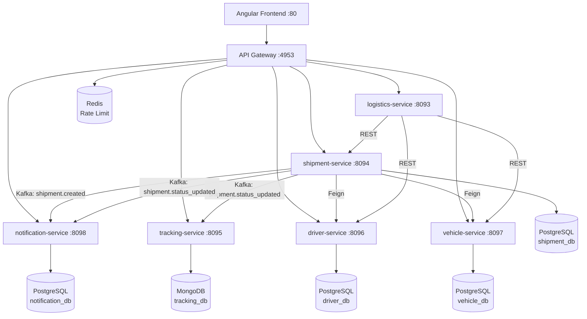

# Logistic System — Overview

## Architecture Diagram

## Service Details

| Service | Port | Database | Role |
|---------|------|----------|------|
| `api-gateway` | 4953 | Redis | Gateway entrypoint for external HTTP requests |
| `logistics-service` | 8093 | N/A | Orchestrator unifying multiple services |
| `shipment-service` | 8094 | PostgreSQL (`shipment_db`) | Core shipment management and routing |
| `tracking-service` | 8095 | MongoDB (`tracking_db`) | Shipment event tracking and real-time history |
| `driver-service` | 8096 | PostgreSQL (`driver_db`) | Driver CRUD and assignments |
| `vehicle-service` | 8097 | PostgreSQL (`vehicle_db`) | Vehicle and fleet management |
| `notification-service`| 8098 | PostgreSQL (`notification_db`) | Asynchronous notification sender (Email, SMS) |
